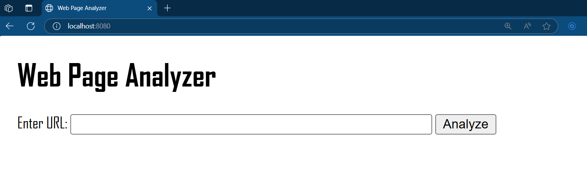
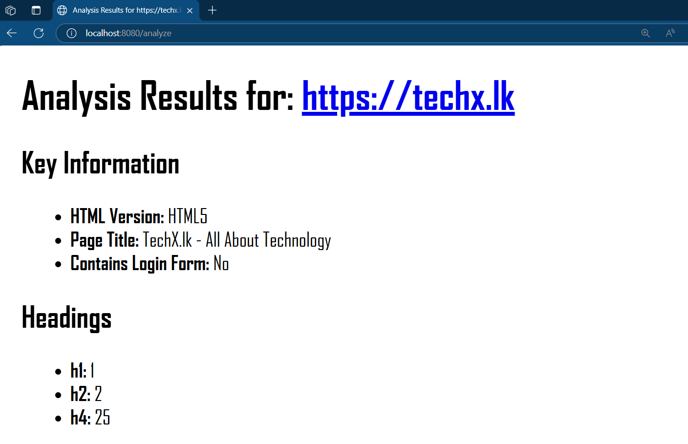
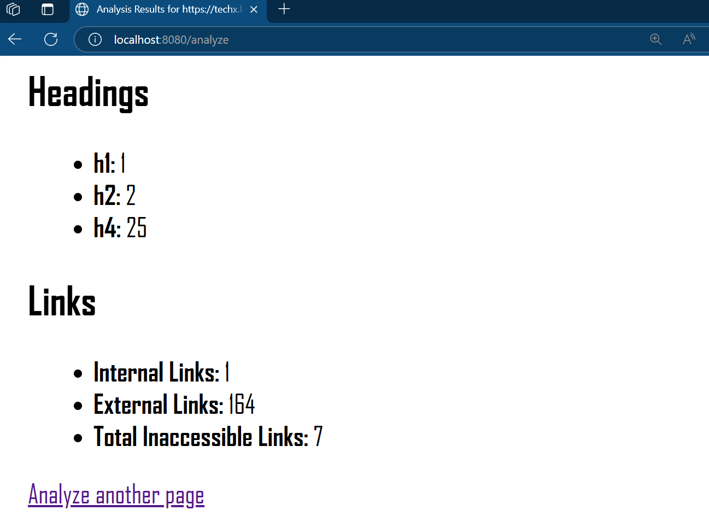

# Web Page Analyzer (Golang)

## Project Overview

This web application analyzes a given web page URL and provides insights into its structure and content. Users can submit a URL through a web form, and the application will display:
- HTML version of the document.
- Page title.
- Counts of headings by level (H1-H6).
- Counts of internal and external links.
- Number of inaccessible links (with details).
- Whether the page appears to contain a login form.

The application handles errors for unreachable URLs, displaying HTTP status codes and descriptions.

## Screenshots

Here is the main form:



And here are some sample results:





## Prerequisites

- Go (version 1.21 or higher recommended for `slog`, a Go version compatible with `golang.org/x/net/html`)
- Git

## Technology Used

- **Backend (BE):** Golang
    - Standard Library: `net/http`, `html/template`, `log/slog`, `net/url`, `sync`
    - External Packages: `golang.org/x/net/html` (for HTML parsing)
- **Frontend (FE):** Basic HTML, CSS (Server-Side Rendered by Go templates)

## External Dependencies

- `golang.org/x/net/html`: For parsing HTML documents.
  - Installation: Managed by Go Modules. `go mod tidy` will fetch it if it's imported in the code and listed in `go.mod`. If not yet in `go.mod`, `go get golang.org/x/net/html` can be used initially.

## Setup Instructions

1.  **Clone the repository:**
    ```bash
    git clone <your-repo-url>
    cd <your-repo-directory-name> # e.g., web-analyzer-go
    ```

2.  **Ensure Go is installed** (see Prerequisites). Your Go environment (GOPATH, GOBIN) should be set up correctly.

3.  **Fetch dependencies:**
    Navigate to the project root directory (where `go.mod` is located) and run:
    ```bash
    go mod tidy
    ```
    This command ensures your `go.mod` file matches the source code's dependencies.

4.  **To run the application:**
    From the project root directory:
    ```bash
    go run main.go
    ```
    The application will typically be available at `http://localhost:8080` (or the port specified in `main.go`).

5.  **To build an executable (optional):**
    You can build a standalone executable from the project root directory:
    ```bash
    go build -o web-analyzer main.go
    ```
    This will create an executable file named `web-analyzer` (or `web-analyzer.exe` on Windows) in the current directory.
    Then run it:
    ```bash
    ./web-analyzer # On Linux/macOS
    # or
    .\web-analyzer.exe # On Windows
    ```

## Usage

1.  Open the application in your web browser (e.g., `http://localhost:8080` if running locally).
2.  Enter a full URL (including `http://` or `https://`) of the web page you want to analyze into the text field.
3.  Click the "Analyze" button.
4.  The results of the analysis will be displayed on a new page (or below the form if an error occurs during submission).

**Main Functionalities:**

-   **URL Input & Validation:** Accepts a URL and performs basic validation (must be HTTP/HTTPS, non-empty).
-   **Web Page Fetching:** Retrieves the content of the given URL.
-   **HTML Parsing:** Parses the HTML structure of the fetched page.
-   **Information Extraction:**
    -   Determines HTML version (heuristic).
    -   Extracts page title.
    -   Counts H1-H6 headings.
    -   Categorizes and counts internal/external links (including `<link href="...">` for stylesheets etc.).
    -   Checks link accessibility concurrently.
    -   Detects presence of login forms (heuristic).
-   **Error Handling:** Provides user-friendly messages for invalid URLs or server-side errors, including HTTP status codes when a page is fetched but returns an error (e.g., 404 Not Found). For network-level errors (e.g., DNS failure), a general error message is shown.
-   **Logging:** Uses structured logging (`slog`) for server-side operational information and errors (output to console/stdout by default).
-   **Concurrency:** Link accessibility checks are performed concurrently using goroutines and a semaphore channel to improve performance.

## Challenges Faced & Approaches Taken

1.  **Defining "HTML Version":** Robustly determining the exact HTML version can be complex.
    * **Approach:** Implemented a heuristic based on the `<!DOCTYPE>` declaration. It identifies HTML5 and some common older doctypes (HTML 4.01, XHTML 1.0) by inspecting the doctype name and public/system identifiers. For unrecognized or missing doctypes, it provides an "Unknown" classification.

2.  **Defining "Login Form":** Login forms vary widely.
    * **Approach:** Used a heuristic approach. The system looks for `<form>` elements. Within these forms, it checks for combinations of:
        * An `<input type="password">`.
        * Text-like input fields (`<input type="text">`, `<input type="email">`) with names commonly associated with login credentials (e.g., "username", "email", "login", "pass").
        * Input fields suggestive of PIN entry (e.g., `type="number"` or `type="tel"` with a name attribute containing "pin").
        * A submit button.
      This approach aims to cover typical username/password forms as well as simple PIN-based logins.

3.  **Checking Link Accessibility Efficiently:** Checking many links sequentially would be slow.
    * **Approach:** Implemented concurrent link checking using Go's goroutines, `sync.WaitGroup` for synchronization, and a semaphore (channel) to limit the number of concurrent HTTP requests. HEAD requests are attempted first for efficiency; if a HEAD request fails with a network-type error, a GET request is attempted as a fallback, as some servers may not properly handle HEAD requests but are otherwise accessible.

4.  **Handling Various Link Types for Counting:** Links for analysis can appear in `<a>` tags or `<link>` tags (e.g., for stylesheets).
    * **Approach:** The link extraction logic parses `href` attributes from both `<a>` and `<link>` tags. Resolved these URLs against the base page URL using `net/url.Parse()` and `URL.ResolveReference()` (implicitly via `baseDomain.Parse()`). Skipped fragment-only links and pseudo-protocols like `javascript:` or `mailto:`.

5.  **Distinguishing Internal vs. External Links:**
    * **Approach:** Compared the scheme and host of the resolved link URL with the scheme and host of the base page URL. Links matching both are considered internal.

6.  **New to Go:** Transitioning from Python.
    * **Approach:** Focused on understanding Go's core concepts (static typing, structs, interfaces, error handling, goroutines, channels) by consulting "A Tour of Go" and official Go documentation. Applied these by building the application incrementally, starting with the standard library (`net/http`, `html/template`) and then incorporating `golang.org/x/net/html`. Leveraged Go's explicit error handling and the `slog` package for structured logging.

## Possible Improvements

1.  **More Robust HTML Version Detection:** Implement a more comprehensive DOCTYPE parser or use a dedicated library if one exists that handles all known doctypes and their nuances.
2.  **Advanced Login Form Detection:** Employ more sophisticated techniques, possibly machine learning or more complex heuristics (e.g., analyzing form structure, surrounding text, common CSS classes/IDs, JavaScript interactions).
3. **Containerization for Deployment (Docker):**
    * **Dockerize the Application:** Create a `Dockerfile` to build a container image for the application. This simplifies deployment, ensures a consistent runtime environment, and facilitates scaling. The Docker image would typically build the Go binary from source and then copy it into a minimal base image along with necessary assets (templates, static files). This aligns with the "Deployment: Try to deploy the app with Docker container" guideline if you choose to pursue it.

## Testing Information

-   **Unit Tests:** Unit tests are provided for the `internal/analyzer` package. These tests cover the core logic, including HTML parsing, extraction of various page elements (title, headings, links, login forms), and the link accessibility checking mechanism.
    -   The `net/http/httptest` package is used to mock HTTP servers and responses, ensuring that tests do not make real external HTTP requests and can run in an isolated environment.
    -   The target for test coverage is over 70% of statements in the `analyzer.go` file. Test coverage can be checked by running the following commands from the project root:
        ```bash
        go test -coverprofile=coverage.out ./...
        go tool cover -html=coverage.out
        ```
        This will generate an HTML report (e.g., `coverage.out.html`, which can be opened in your browser) showing line-by-line coverage.